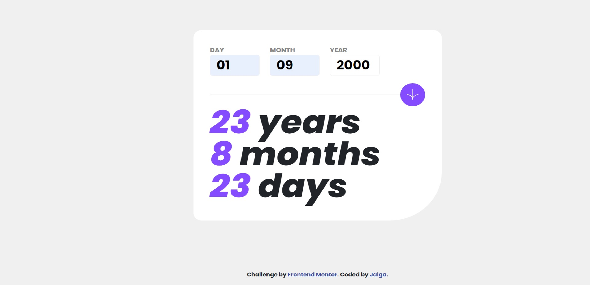
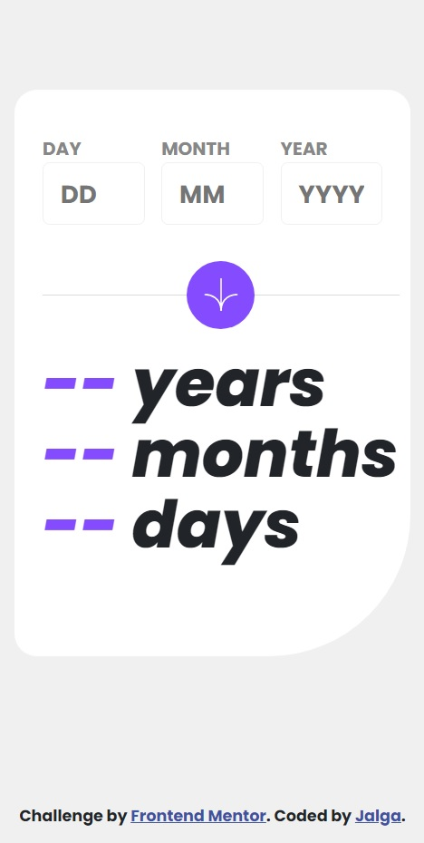

# Frontend Mentor - Age calculator app solution

## Table of contents

- [Overview](#overview)
  - [The challenge](#the-challenge)
  - [Screenshot](#screenshot)
- [My process](#my-process)
  - [Built with](#built-with)
  - [What I learned](#what-i-learned)
  - [Continued development](#continued-development)
  - [Useful resources](#useful-resources)
- [Author](#author)
- [Acknowledgments](#acknowledgments)

## Overview

### The challenge

Users should be able to:

- View an age in years, months, and days after submitting a valid date through the form
- Receive validation errors if:
  - Any field is empty when the form is submitted
  - The day number is not between 1-31
  - The month number is not between 1-12
  - The year is in the future
  - The date is invalid e.g. 31/04/1991 (there are 30 days in April)
- View the optimal layout for the interface depending on their device's screen size
- See hover and focus states for all interactive elements on the page
- **Bonus**: See the age numbers animate to their final number when the form is submitted

### Screenshot




## My process

### Built with

- Semantic HTML5 markup
- CSS custom properties
- Flexbox
- CSS Grid
- Mobile-first workflow
- [Bootstrap](https://getbootstrap.com/) - CSS library
- [Jquery](https://jquery.com/) - React framework
- [Vanilla Javascript](https://developer.mozilla.org/en-US/docs/Web/JavaScript) - For logic of the program

### What I learned

I learned how to mix Grid with Flexbox and Media Query.

Also learned how to shorten code instead of writing more if statements.

```js
function isLeap(year) {
    return (year % 4 == 0 && year % 100 != 0) || year % 400 == 0;
}
```

### Continued development

I want to focus on fast writing html and css according to a picture.
So when I start working for company, I could be productive.

### Useful resources

- [MDN Web Docs](https://developer.mozilla.org/en-US/) - helped me find answers when I got stuck.

## Author

- Website - [Jalga](https://github.com/coder-96)
- Frontend Mentor - [@@coder-96](https://www.frontendmentor.io/profile/coder-96)
- Twitter - [@jsaga_](https://www.twitter.com/jsaga_)

## Acknowledgments

Thanks to my family that supports me on my way to becoming a beast Full Stack Developer. 